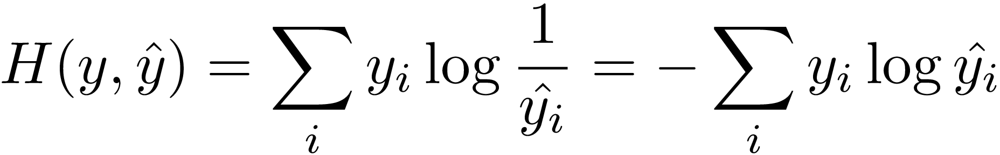

Cross Entropy formula



Calculating cross entropy in python

```python
import numpy as np

y =  [0, 0, 0, 1, 0]

y_cap =  [0.27, 0.11, 0.33, 0.10, 0.19]

cross_entropy = 0

for i in range(len(y)):
    cross_entropy += y[i] * np.log(y_cap[i])

cross_entropy = cross_entropy * -1
print("cross_entropy", cross_entropy)
# cross_entropy 2.30258509299
```

Conda env for TFlearn

conda create -n tflearn python=3.5

source activate tflearn


conda install numpy pandas jupyter notebook matplotlib


conda install scipy h5py

pip install tensorflow

